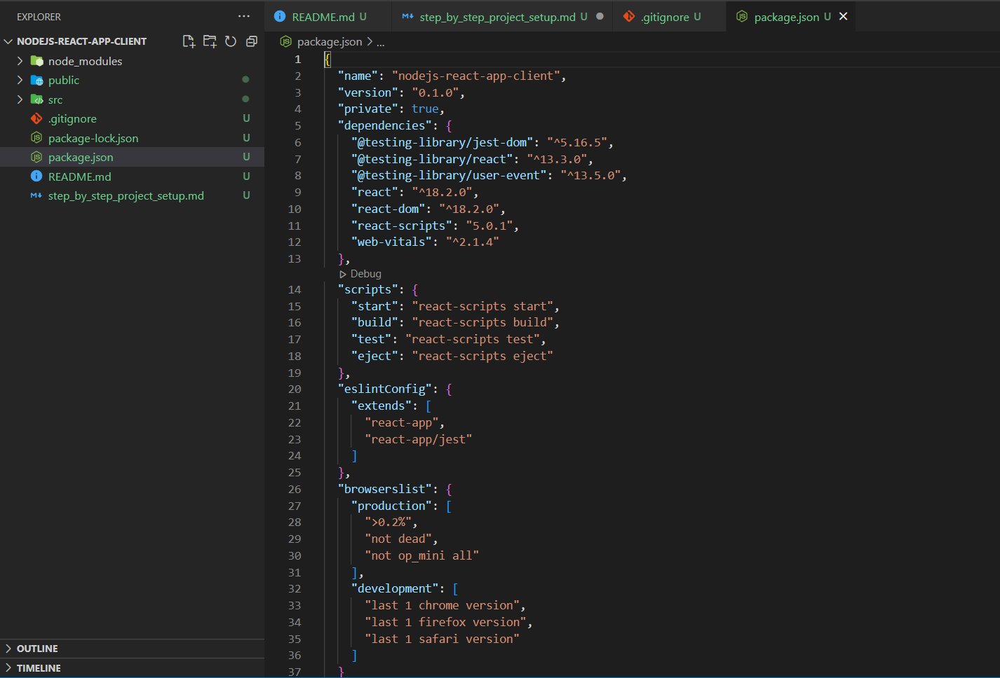
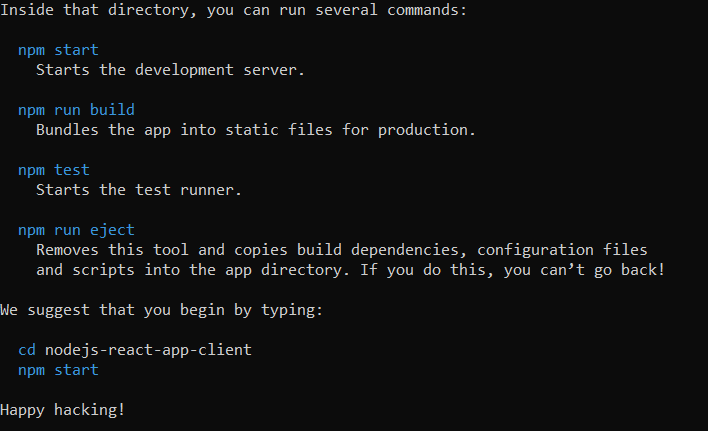
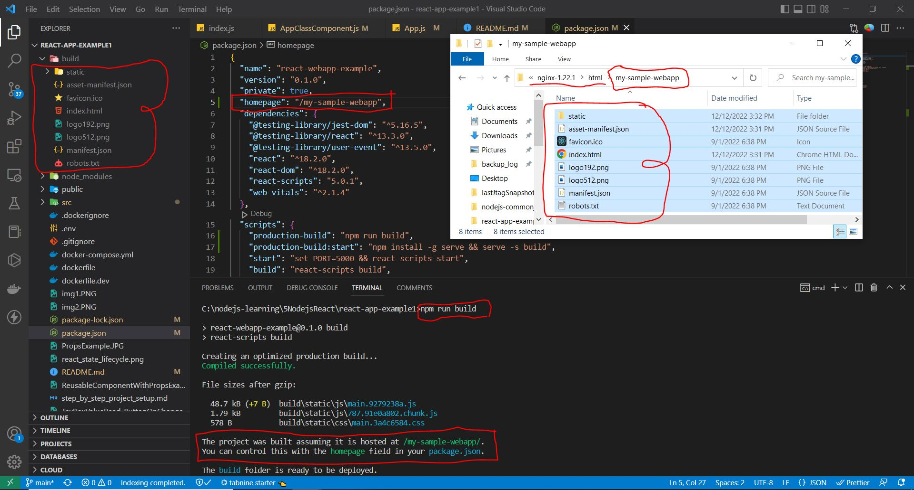
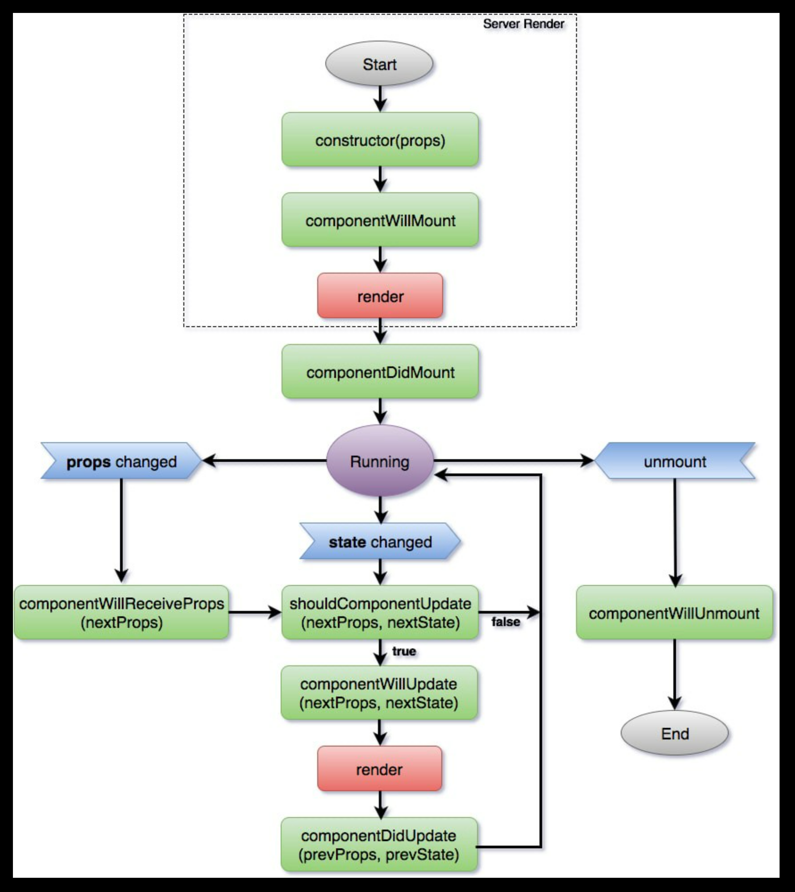

# NodeJS Learning:
| | | |
| - | - | - |
| [](https://www.youtube.com/watch?v=f2EqECiTBL8) | [](https://www.youtube.com/watch?v=eHpetRB8qTw&list=PL_euSNU_eLbdf5XbrFl-nOw6-7ZtT27Bn&index=1) | [](https://www.youtube.com/watch?v=2e2E5cvLw0g&list=PL8p2I9GklV456iofeMKReMTvWLr7Ki9At&index=29) |

### Sample github project using create-react-app:
> https://github.com/Sanjeev-Thiyagarajan/node-docker \
> https://github.com/Sanjeev-Thiyagarajan/docker-node-practice

# Step : 1 - Create React application using create-react-app template.
> npx create-react-app react-app-example1
>  

# Step : 2 - React App Folder Structure: 
> application dependency [npm command] file : package.json \
> public page [Start] : public/index.html \
> application folder [root] : src \
> application Base [page] : src/index.js \
> application Base [component] : App.js

# Step: 3 - React-App Request Workflow:

[](https://www.youtube.com/watch?v=42xdvj-hPX8)

> npm run start \
> http://localhost:3000 \
>  ->   public/index.html (root div)\
>  -->  src\index.js (render App component into root div)\
>  ---> src\App.js ( Props, State, component events load/change/destroy, JSX template )

# Step: 4 - React-App Prodcution Build:
    cmd:/> npm run build

# Step: 5 - React-App Prodcution Build Test in development environment:

    cmd:/> npm install -g serve \
    cmd:/> serve -s build

```
Find out more about deployment here:
  https://cra.link/deployment
```
# Step: 6 - Nginx Setup on Windows:

    copy nginx*.zip into some directory and add that path into system variables.
    Goto that path and Run below command's for Start/Stop server.

**Start Server**

    cmd:/> nginx.exe

**Stop Server**

    cmd:/> nginx.exe -s quit
    | or |
    cmd:/> wmic process where name='nginx.exe' delete





# React production build deployment on Nginx Server.
|||
| --- | --- |
| [](https://www.youtube.com/watch?v=tGYNYPKTyno) | [](https://www.youtube.com/watch?v=cu419lg9zrw) |
| https://www.tutorialspoint.com/reactjs/reactjs_building_deployment.htm | |


# React-App Dockerized Container:
||||
| ----------- | ----------- | ----------- |
| [](https://www.youtube.com/watch?v=WOeSkyM9mRY&list=PL0zysOflRCekdY4189QaG0YkxJ6yDaP1F&index=4)      | [](https://www.youtube.com/watch?v=6p7lylJEjrU)       | [](https://www.youtube.com/watch?v=3xDAU5cvi5E&t=4049s)       |


# AXIOS REST Client:
[](https://www.youtube.com/watch?v=Gl-vOU7ZU9A)


# React State Lifecycle Management:



# React Basics
|||||||||
| --- | --- | --- | --- | --- | --- | --- | --- |
| [](https://www.youtube.com/watch?v=na0MVIomjmk&list=PLwGdqUZWnOp3aROg4wypcRhZqJG3ajZWJ&index=31) | [](https://www.youtube.com/watch?v=EG0LhIfmUSo&list=PLwGdqUZWnOp3aROg4wypcRhZqJG3ajZWJ&index=29) | [](https://www.youtube.com/watch?v=tmt7lf2nCBY&list=PL8p2I9GklV47BCAjiCtuV_liN9IwAl8pM&index=11) | [](https://www.youtube.com/watch?v=E878PZtIZLY&list=PL8p2I9GklV47BCAjiCtuV_liN9IwAl8pM&index=27) | [](https://www.youtube.com/watch?v=WoUpht1zcG0&list=PL8p2I9GklV47BCAjiCtuV_liN9IwAl8pM&index=29) | [](https://www.youtube.com/watch?v=m8ZrNPykXes&list=PL8p2I9GklV47BCAjiCtuV_liN9IwAl8pM&index=32) | [](https://www.youtube.com/watch?v=2RfHRaASO8M&list=PLSsAz5wf2lkK_ekd0J__44KG6QoXetZza&index=17) | [](https://www.youtube.com/watch?v=lH92njo0RbM&list=PLStdkmnF3FJVuyAHpIFCGOsBXUWxuovQK&index=11) |


# React State VS Redux State:

  1. React State (Local State Store) and Redux State (Global State Store) 
  2. React State Changes come from child to parant of parent's propagate but in Redux State We can directly propagate to Subscribe Components.
 

**Webpack:** Used for bundle of file type html | javascript | stylesheet in single-single bundle file using webpack-loader. Example css-loader, js-loader etc...


**babel:** Used for javascript backward compatibility library. Which will transpile latest Javascript code into older version which will support by almost all browsers.


**Create-React-App internally integration with Webpack & Babel for browser backward compatibility support:**
|||
| ----------- | ----------- |
| [](https://www.youtube.com/watch?v=Y2pA6pz-ffM) |  |


**Create ReactWebApp without using 'npx create-react-app' from Scratch:**
||||
| ----------- | ----------- | ----------- |
| [](https://www.youtube.com/watch?v=WDpxqopXd9U) | [](https://www.youtube.com/watch?v=h3LpsM42s5o) | [](https://www.youtube.com/watch?v=aT1rkp1UJ00) |


# React + Express Communication: 
|||
| ----------- | ----------- |
| [](https://www.youtube.com/watch?v=JSUGAttC1e0) | |


# React + Python REST-API Communication: 
[](https://www.youtube.com/watch?v=e63EBEFJkH0)
