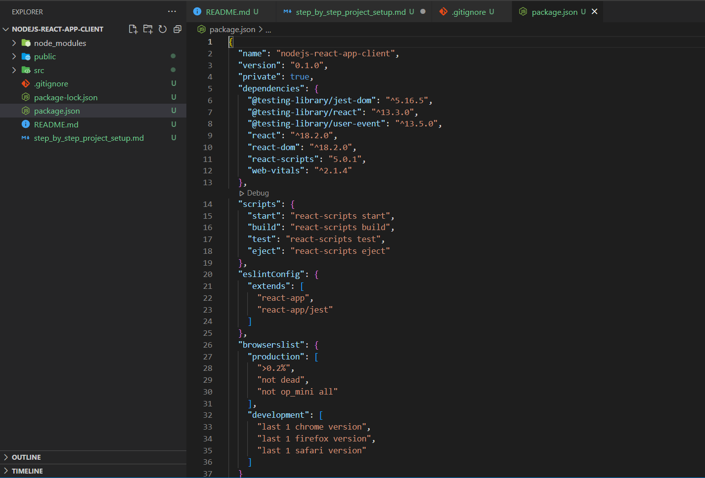
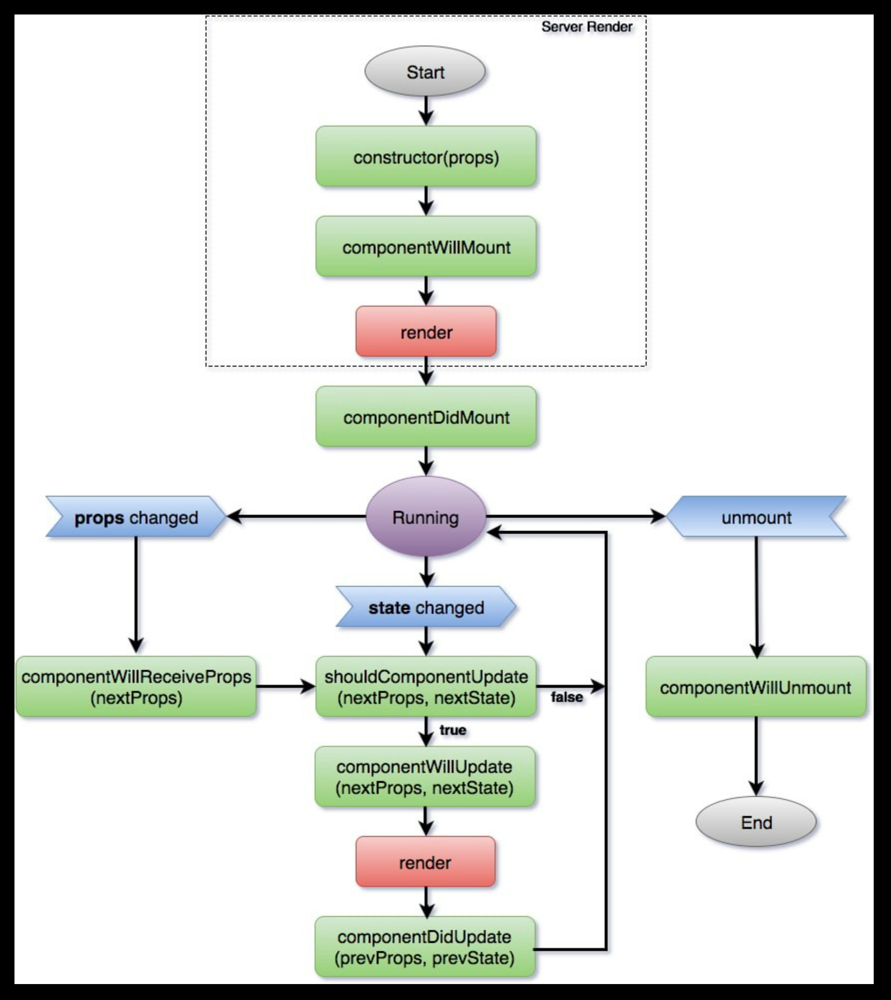

# We need to  uninstall create-react-app globally.
> npm uninstall -g create-react-app

```
Note that the development build is not optimized.
To create a production build, use ***npm run build***.

The project was built assuming it is hosted at /.
You can control this with the homepage field in your package.json.

The build folder is ready to be deployed.
You may serve it with a static server:

  npm install -g serve
  serve -s build

Find out more about deployment here:

  https://cra.link/deployment
```
# React production build deployment on Nginx Server.

**Nginx Setup on Windows**

    copy nginx*.zip into some directory and add that path into system variables.
    Goto that path and Run below command's for Start/Stop server.

**Start Server**

    cmd:/> nginx.exe

**Stop Server**

    cmd:/> nginx.exe -s quit
    | or |
    cmd:/> wmic process where name='nginx.exe' delete


| React-App basic working: | |
| ----------- | ----------- |
| [](https://www.youtube.com/watch?v=42xdvj-hPX8) | [](https://www.youtube.com/watch?v=aBIR4suUbV4&list=PL-6FWL4WVVWUR5BZKA1qn7WZ-7u9Z9Q5K) |

### Sample github project using create-react-app:
> https://github.com/Sanjeev-Thiyagarajan/node-docker \
> https://github.com/Sanjeev-Thiyagarajan/docker-node-practice

### Step : 1 - Create React application using create-react-app template.
> npx create-react-app react-app-example1
>  

> # React App Folder Structure: 
> application dependency [npm command] file : package.json \
> public page [Start] : public/index.html \
> application folder [root] : src \
> application Base [page] : src/index.js \
> application Base [component] : App.js

> Components are the building blocks of React Application. \
> Components are reusable and can be nested in other components 
> # 2 Types of components:
> - Functional components
> - class based components

> JSX - Javascript-XML Template Engine.
> # JSX Restrictions:
> - className we can't use because of javascript keyword.
> - 1 parent container should present for all JSX elements.
> - functional components are not needed explicitly import React class.

# Request Workflow from Client -To- Server
> npm run start \
> http://localhost:3000 \
>  ->   public/index.html (root div)\
>  -->  src\index.js (render App component into root div)\
>  ---> src\App.js ( Props, State, component events load/change/destroy, JSX template )

# Extension/Plugin: [React Component Code Snippets generater]
>    - ES7+ React/Redux/React-Native snippets

# Function based components 
> [ React State Hook using **Redux** ]

# class based components 
> [ React State ]

# Props
> Make Components Reusable via pass Properties

# React State Lifecycle Management:


# Event Handling 
> [ onClick, onChange, onMouseOver, onFocus ] \
> https://www.youtube.com/watch?v=lH92njo0RbM&list=PLStdkmnF3FJVuyAHpIFCGOsBXUWxuovQK&index=11

# 2 Way Data Binding

# Redux State Lifecycle Management:

# React State VS Redux State:
> 1. React State (Local State Store) and Redux State (Global State Store) 
> 2. React State Changes come from child to parant of parent's propagate but in Redux State We can directly propagate to Subscribe Components.

https://www.youtube.com/watch?v=kkuq0gTGRFQ

# Note:
 - Migration from class based components to Funtion based components, We have to change **state** --to--> **state Hook**.
 - Class based component used **state**
 - Function based component used **state Hook**
 - https://www.youtube.com/watch?v=OACngUCAvNU&list=PLStdkmnF3FJVuyAHpIFCGOsBXUWxuovQK&index=14
 

# React-App Dockerized Container:
| React-App Dockerized Container: |||
| ----------- | ----------- | ----------- |
| [](https://www.youtube.com/watch?v=WOeSkyM9mRY&list=PL0zysOflRCekdY4189QaG0YkxJ6yDaP1F&index=4)      | [](https://www.youtube.com/watch?v=6p7lylJEjrU)       | [](https://www.youtube.com/watch?v=3xDAU5cvi5E&t=4049s)       |


**Webpack:** Used for bundle of file type html | javascript | stylesheet in single-single bundle file using webpack-loader. Example css-loader, js-loader etc...

**babel:** Used for javascript backward compatibility library. Which will transpile latest Javascript code into older version which will support by almost all browsers.

| Create-React-App internally integration with Webpack & Babel for browser backward compatibility support: | |
| ----------- | ----------- |
| [](https://www.youtube.com/watch?v=Y2pA6pz-ffM) |  |

| Create ReactWebApp without using 'npx create-react-app' from Scratch: |||
| ----------- | ----------- | ----------- |
| [](https://www.youtube.com/watch?v=WDpxqopXd9U) | [](https://www.youtube.com/watch?v=h3LpsM42s5o) | [](https://www.youtube.com/watch?v=aT1rkp1UJ00) |

# React + Express Communication: 

| React + Express Communication: | |
| ----------- | ----------- |
| [](https://www.youtube.com/watch?v=JSUGAttC1e0) | |


# React + Python REST-API Communication: 
[](https://www.youtube.com/watch?v=e63EBEFJkH0)