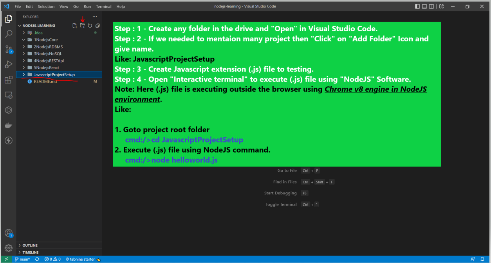
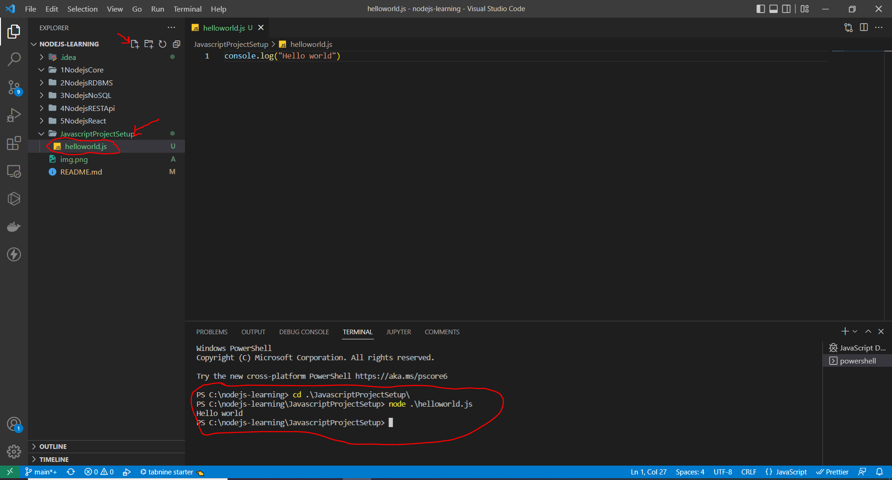
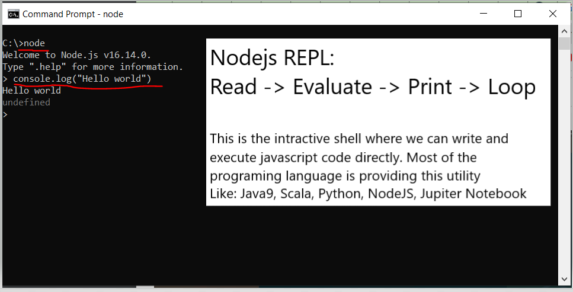
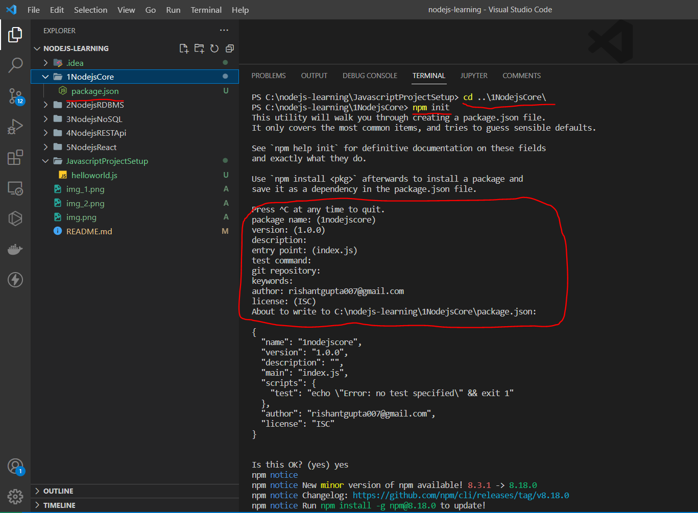
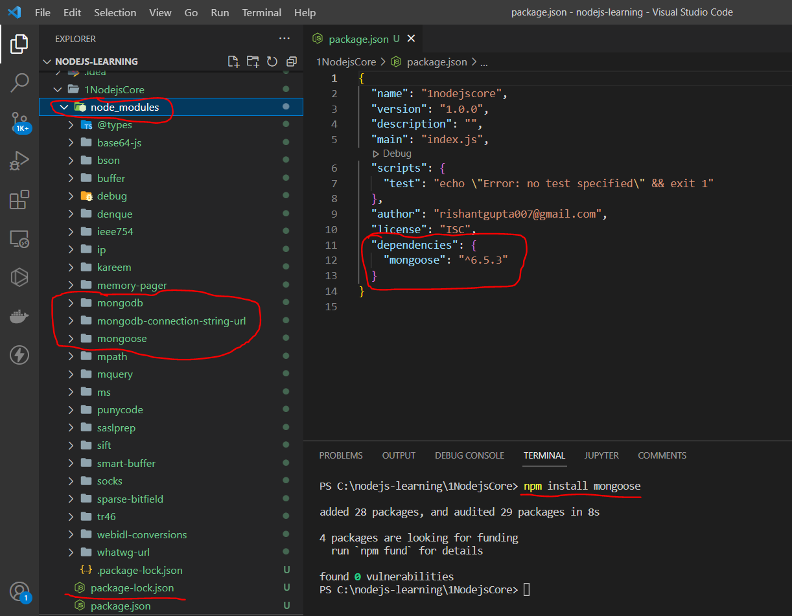
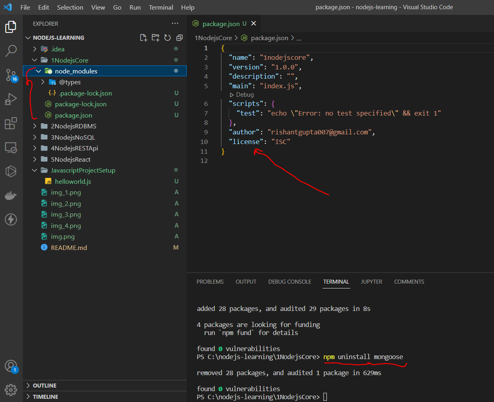
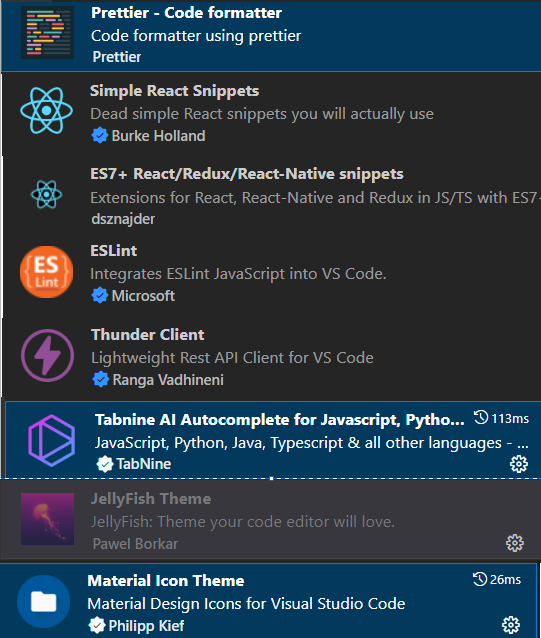

# nodejs-learning
nodejs -> core, database communication, Express Backend Rest-Api, React Frontend Web-Application 

# MERN Stack Application:

# Basic Requirements:
> 1. Javascript Installation (It is pre-installed with Browser installation)
> 2. NodeJS Installation (Use chrome v8 engine behind to execute JS code)
> 3. Visual Studio Code IDE (Development Environment)

# Javascript Project Setup:
> **Setup:**

> **Test and verify using NodeJs command execution:**

> **REPL:** 

# NodeJS Project Setup:
**Create new scratch nodejs project using Node Package Manager** 
> cmd:/> npm init

**Open nodejs project in VSCode**
> 1. package.json

> 2. Install external module dependencies using Node Package Manager \

> 3. Uninstall external module dependencies using Node Package Manager \

> 4. Create NodeJS Project Structure for Better code management. \

> 5. VSCode Plugin/Extension's for Nodejs projects. \

# References: *** VsCode Learning \***

# References: *** NodeJS Learning \***

# References: *** ReactJS Learning \***

# References: *** React + Redux Learning \***

# References: *** React + Authentication Learning \***

# References: *** MERN Fullstack Projects Video \***

